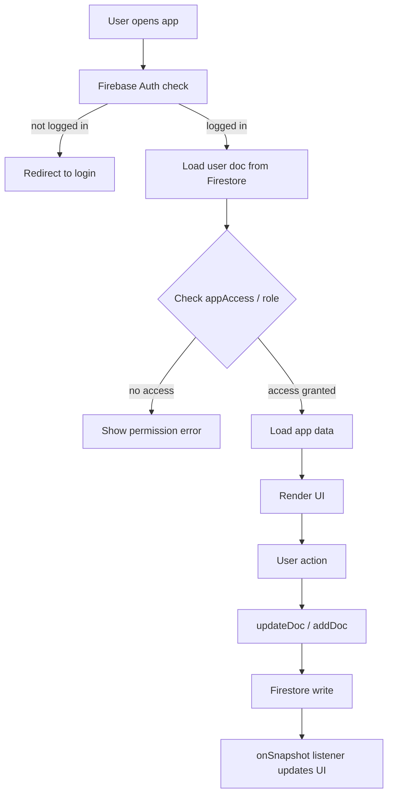

# Architecture Docs

Produce architecture diagrams, data-flow documentation, and a canonical repo doc for any Tinker app.

## $ARGUMENTS

Pass the repo path or app name: `/architecture-docs ~/tinker-kpi/`

## When to invoke

- Starting a new app (document the design before building)
- Onboarding someone to an existing app
- Before a major refactor (document current state first)
- When asked "how does X work?"

## Step 1 — Gather facts

Read these files (adjust paths for the app):
```bash
cat "$REPO/index.html" | head -100         # page structure, tab names
cat "$REPO/js/app.js" | head -200          # main entry, key functions
grep -n "collection\|doc\|getDocs\|addDoc\|updateDoc\|setDoc\|deleteDoc" "$REPO/js/app.js" | head -50
grep -n "function \|const.*=.*function\|=> {" "$REPO/js/app.js" | head -50
```

Also check:
- Firestore collections used
- localStorage keys used
- External APIs called
- Auth roles checked

## Step 2 — Architecture overview (text)

Write a short description:
```
## App: [Name]

**Purpose**: [one sentence — who uses it and what they accomplish]

**Users**: [admin / manager / staff / public]

**Tech**: Vanilla HTML + CSS + JS, Firebase Firestore, Firebase Auth, hosted on [Netlify/Render]

**Firebase project**: tinker-hq-apps

**Firestore collections**:
- `[collection]`: [what it stores, who reads/writes it]

**localStorage**:
- `[key]`: [what it caches]

**External integrations**: [none / Google Sheets / etc.]
```

## Step 3 — Data flow diagram (Mermaid)



Customize this template for the actual app's flow. Use plain text if Mermaid isn't available.

## Step 4 — Firestore data model

For each collection:
```
Collection: [name]
Document ID: [auto / uid / custom key]
Fields:
  - [field]: [type] — [what it means]
  - [field]: [type] — [what it means]
Who reads: [admin / manager / staff with appAccess('[app]')]
Who writes: [admin / manager / app logic]
Rule location: /Users/christiehubley/studio-hub/firestore.rules — [line number range]
```

## Step 5 — Key function map

List the 10-15 most important functions and what they do:
```
loadData()          — fetches all documents from [collection], populates the UI
saveEntry()         — writes a new doc via addDoc, awaits confirmation
updateEntry(id)     — partial update via updateDoc, strips empty fields
deleteEntry(id)     — confirms with user, snapshots before deleting
renderTable()       — rebuilds the UI from in-memory data array
listenForChanges()  — onSnapshot listener, updates UI in real-time
```

## Step 6 — Write the doc

Save to `$REPO/docs/architecture.md` or, if the repo has no docs folder, to `$REPO/ARCHITECTURE.md`.

Commit:
```bash
git add docs/architecture.md  # or ARCHITECTURE.md
git commit -m "docs: add architecture overview and data-flow diagram"
```

## Output format

Prefer markdown with embedded Mermaid. If the output is going into a plan or review, use plain ASCII art instead:

```
[User] → [Auth check] → [Firestore read] → [UI render] → [User edit] → [Firestore write] → [UI update]
```
